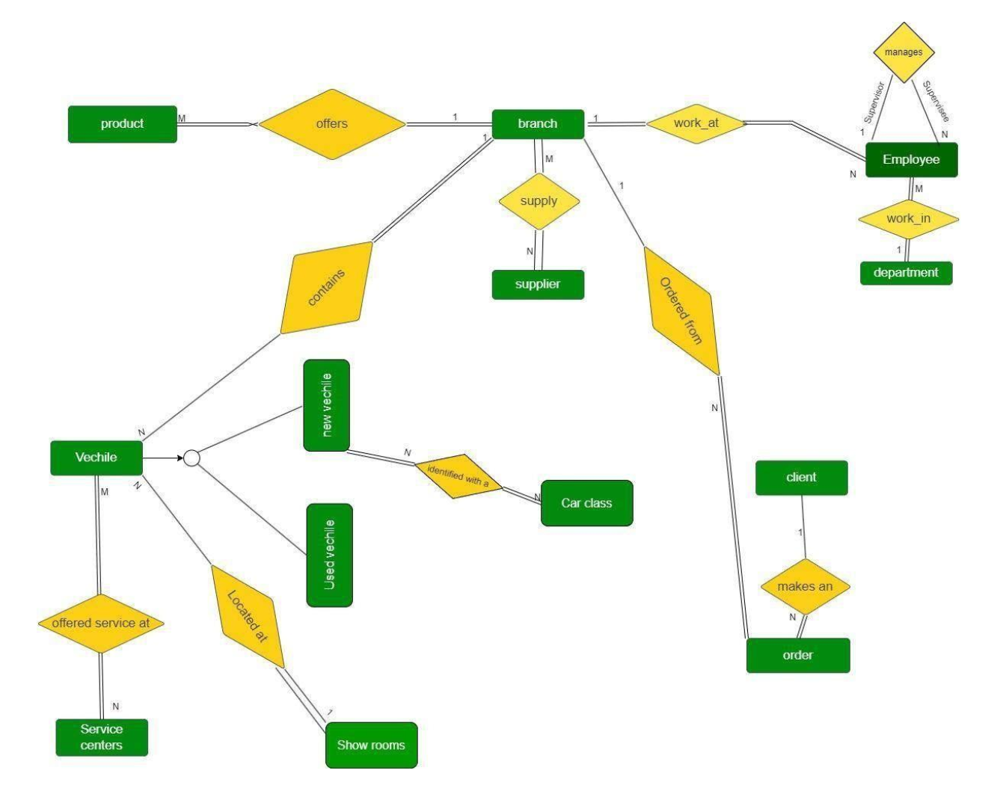
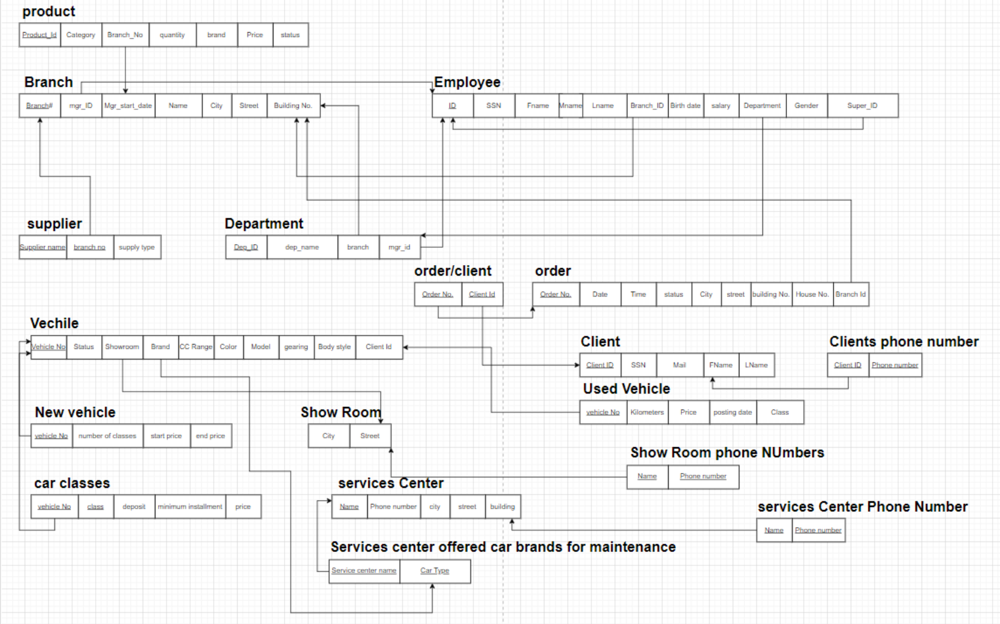

# Car Retailer Website

Welcome to the **Car Retailer Website** project! This project demonstrates the practical application of our web development skills by creating a comprehensive car retail management system. It includes separate views for **Admin** and **Client**, each with tailored functionalities and interface designs.

## Table of Contents
- [Overview](#overview)
- [Features](#features)
  - [Admin View](#admin-view)
  - [Client View](#client-view)
- [Wireframes and Mockups](#wireframes-and-mockups)
- [Database Models](#database-models)
  - [ER Diagram](#er-diagram)
  - [Relational Model](#relational-model)
- [Installation](#installation)
- [Usage](#usage)
- [Demo](#demo)
  - [Screenshots](#screenshots)
  - [GIFs](#gifs)
- [Technologies Used](#technologies-used)
- [Learning Outcomes](#learning-outcomes)
- [Contributing](#contributing)
- [License](#license)

---

## Overview
The **Car Retailer Website** project offers a platform for car dealerships to manage their inventory, clients, and transactions. It provides:
- **Admin View**: Allows management of cars, clients, and transactions.
- **Client View**: Enables customers to view available cars, inquire about models, and make purchases.

## Features

###  User View
- **Profile Management**: View and edit their profile.
- **Car Details**: View detailed car pages with specifications and prices.
- **Car Comparison**: Compare two or more cars side by side.
- **Purchase and Shipping**: Buy a car and ship it to a specified address.
- **Car Rentals**: Rent a car for specific purposes (e.g., weddings, taxis, security, or general use).
- **Recommendations**: Receive tailored recommendations for new cars.
- **Service Center Locator**: Search for the nearest service centers for their car model.
- **Purchase Parts and Accessories**: Buy car parts and accessories.
- **Urgent Support**: Request urgent assistance.
- **Product and Service Reviews**: Review products and services offered by the retailer.

###  Admin View
- **Order Management**: Track, update, and view the status of orders.
- **Inventory Requests**: Request restocking of sold-out products and approve/deny restocking requests.
- **Customer Management**:
  - **Profile Access**: View customer profiles on the website.
  - **Account Actions**: Request banning of customers when needed.
- **Employee Tracking**: Monitor employee progress and review customer feedback on interactions.
- **Order Reporting**: View comprehensive reports on orders and customer feedback.
- **Inventory Management**: Add new cars to the inventory and update prices.
- **Analytics and Statistics**: View statistical data for performance tracking and analysis.
- **Payment and Integration Management**:
  - **Payment Management**: Manage payment methods available on the website.
  - **Third-Party Integrations**: Set up and manage integrations with third-party services, such as Google Maps API.


## Database Models

### ER Diagram
Our Entity-Relationship (ER) Diagram defines the database structure, showing the relationships between tables such as **Cars**, **Clients**, and **Transactions**.

  

### Relational Model
The Relational Model diagram further details the table schemas and key relationships.

  

## Installation
Follow these instructions to set up the Car Retailer Website project locally:

1. **Clone the Repository**
   
   ```bash
   git clone https://github.com/username/car-retailer-website.git
   cd car-retailer-website
   ```

## Usage
Once the setup is complete, navigate to `http://localhost:3000` in your browser to start using the Car Retailer Website.

- **Admin**: Access admin functionalities at `http://localhost:3000/admin`.
- **User**: Access client view at `http://localhost:3000`.


## Demo

<iframe width="560" height="500" src="https://www.youtube.com/embed/c2rLxld9cf4?rel=0" frameborder="0" allowfullscreen></iframe>


## Technologies Used

- **Frontend**: HTML, CSS, JavaScript, Bootstrap
- **Backend**: ASP.net
- **Database**: MSSQL Server
- **Additional Libraries and APIs**: Google Maps, Google Charts

## Learning Outcomes
Through this project, we applied key concepts learned in class and through self-study, including:
- **Frontend Design**: Designing a responsive UI for both admin and client views.
- **Backend Development**: Structuring RESTful APIs to support frontend interactions and ensure data consistency.
- **Database Design**: Modeling data relationships and implementing a relational database.
- **Version Control**: Using Git and GitHub for collaboration and version tracking.

## Contributing
We welcome contributions to this project. If you have suggestions, please open an issue or submit a pull request.

## License
This project is licensed under the [MIT License](link_to_license).